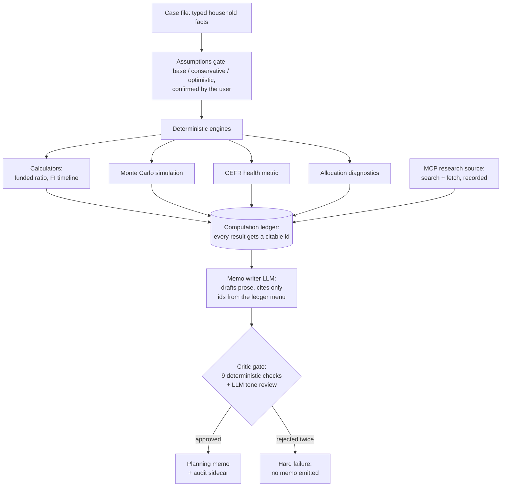

# agentic-financial-planner-lab

[](https://github.com/jman4162/agentic-financial-planner-lab/actions/workflows/ci.yml)
[](https://pypi.org/project/planner-lab/)

[](LICENSE)

An experimental, provider-neutral framework for building auditable personal-finance planning agents: a typed case file, deterministic calculators, a Monte Carlo simulation adapter, cited research through the Model Context Protocol, and a critic gate that blocks any memo whose numbers cannot be traced to a recorded computation.

**The LLM never does the math.** Every dollar figure in an output memo resolves to a recorded calculator run or a case-file field, and a critic rejects the memo otherwise. This is a research and education project: not a financial advisor, no trade execution, no stock picking, no required account anywhere. Examples use synthetic households only (see the [disclaimer](#license)).


**Keywords:** financial planning, retirement readiness, Monte Carlo simulation, LLM agents, Model Context Protocol (MCP), funded ratio, safe withdrawal rate, personal finance, FIRE.

## Architecture

The LLM appears at exactly two points (memo drafting and a tone review); everything else is deterministic, seeded, and testable.



## How it compares

| | Spreadsheet / DIY | Web retirement simulators | Generic LLM chat | This project |
|---|---|---|---|---|
| Deterministic, seeded math | yes | yes | no | yes |
| Explains trade-offs in prose | no | limited | yes | yes |
| Every number traceable to a computation | manual | no | no | enforced by a critic |
| Cited methodology sources | manual | some | fabrication risk | fetched and verified |
| Runs fully local | yes | no | rarely | yes (Ollama) |
| Refuses unverifiable output | n/a | n/a | no | yes |

## Install

Requires Python 3.11+.

```bash
pip install "planner-lab[agent]"        # from PyPI
```

Or work from a clone:

```bash
uv sync --extra agent --extra dev
```

Extras are optional by design. The core installs without any agent framework; `agent` adds the Strands SDK (with Ollama and OpenTelemetry support), `mcp` adds Model Context Protocol clients for research sources.

## Try it

The core works offline with no LLM:

```bash
uv run planner-lab validate examples/cases/sample_household.yaml
uv run planner-lab calc funded-ratio --portfolio 900000 --spending 50000
uv run planner-lab calc fi-timeline --portfolio 250000 --savings 50000 --spending 60000
```

With a local [Ollama](https://ollama.com/) server running and a tool-calling-capable model pulled (default `qwen3`; override with `OLLAMA_MODEL`):

```bash
# Full pipeline: assumptions -> calculators -> memo draft -> critic gate -> memo
uv run planner-lab memo examples/cases/sample_household.yaml -o memo.md --yes

# Add Monte Carlo simulation, the fundedness metric, and allocation diagnostics
uv sync --all-extras
uv run planner-lab analyze examples/cases/sample_household.yaml --simulate --health --allocation --yes

# Ground the memo's methodology in cited guides from an MCP research server
PLANNER_LAB_RESEARCH_MCP_URL=https://example.com/mcp \
  uv run planner-lab memo examples/cases/sample_household.yaml -o memo.md --yes --research

# Derive annual cash flow from a budgeting-app CSV export (no LLM involved)
uv run planner-lab import-cashflow examples/data/sample_transactions_monarch.csv \
  --format monarch --case my_case.yaml --write

# Interactive intake chat that builds a case file
uv run planner-lab intake -o my_case.yaml

# Minimal agent-plus-tool example
uv run python examples/hello_agent.py
```

The memo command writes the markdown memo plus a `.audit.json` sidecar holding the full computation ledger and critic report, so every number can be checked by hand. If the critic rejects the draft twice, no memo is written and the failing checks are printed.

## Case studies

Full walkthroughs with real generated memos, checked in verbatim:

- [An on-track couple, full analysis](docs/case-studies/on-track-couple.md): simulation percentiles, the CEFR health metric, allocation diagnostics, and cited research in one run.
- [Data gaps and CSV import](docs/case-studies/data-gaps-and-csv-import.md): missing data is disclosed, then partially filled from a transactions export with no LLM involved.
- [A rejected memo](docs/case-studies/rejected-memo.md): what the critic gate catches, and why the worst case is no memo rather than a wrong one.

## How a run works

1. The case file is loaded and validated; material gaps are recorded.
2. Base, conservative, and optimistic assumption sets are shown for confirmation (`--yes` accepts them non-interactively). Rates are real, after inflation.
3. Deterministic calculators run per assumption set: funded ratio, years to financial independence, sustainable spending. Each result lands in the computation ledger with an id.
4. Optionally, a Monte Carlo engine simulates each set (plus crash and sequence-risk stress runs) behind a generic `ScenarioSimulator` interface.
5. The LLM drafts the memo, citing numbers only from the ledger menu it is given.
6. The critic runs eight deterministic checks (traceability, no securities advice, disclaimer, assumption disclosure, missing-data disclosure, citation consistency, real/nominal labeling, certainty language) plus an LLM tone review. One revision is attempted; then the run fails.

## Configuration

Everything is configured through environment variables; nothing is hardcoded.

| Variable | Purpose | Default |
|---|---|---|
| `PLANNER_LAB_MODEL_PROVIDER` | `ollama` or `bedrock` | `ollama` |
| `OLLAMA_HOST` / `OLLAMA_MODEL` | Local model server and model id | `http://localhost:11434` / `qwen3` |
| `PLANNER_LAB_BEDROCK_MODEL` | Bedrock model id (provider `bedrock`) | provider default |
| `PLANNER_LAB_RESEARCH_MCP_URL` | Streamable-HTTP MCP server exposing `search` and `fetch` tools; enables `--research` | unset |
| `OTEL_EXPORTER_OTLP_ENDPOINT` / `OTEL_EXPORTER_OTLP_HEADERS` | OTLP tracing target for `setup_telemetry("otlp")`; `--trace` prints spans to stdout | unset |

Small local models occasionally mis-copy a number or skip a citation; the critic then rejects the memo after one revision attempt rather than emitting it. A larger model (for example `OLLAMA_MODEL=gpt-oss:20b`) makes full runs with simulation, diagnostics, and research more reliable.

Optional extras: `agent` (LLM pipeline, Strands SDK), `planning` (Monte Carlo simulation, fundedness metric), `portfolio` (lifecycle allocation diagnostics), `mcp` (research sources), `dev` (tests, lint, types). The core installs with none of them.

## Status

Working retirement-readiness pipeline: case-file schemas, deterministic calculators, critic gate, memo renderer, interactive intake, Monte Carlo simulation, certainty-equivalent funded ratio (CEFR) metric, lifecycle allocation diagnostics, MCP research citations, and CSV cash-flow import. See `CLAUDE.md` for architecture rules.

## Citation

```bibtex
@software{hodge_agentic_financial_planner_lab,
  author  = {Hodge, John},
  title   = {agentic-financial-planner-lab: an auditable financial planning agent framework},
  year    = {2026},
  url     = {https://github.com/jman4162/agentic-financial-planner-lab},
  version = {0.1.1},
  license = {MIT}
}
```

## License

MIT. Educational use; nothing here is financial advice.
